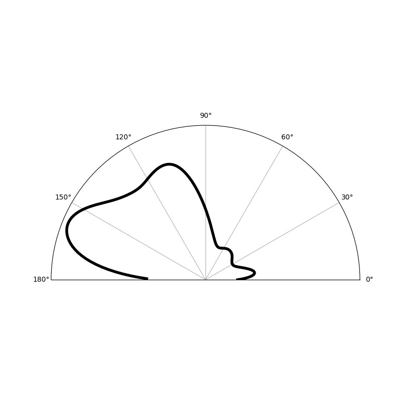
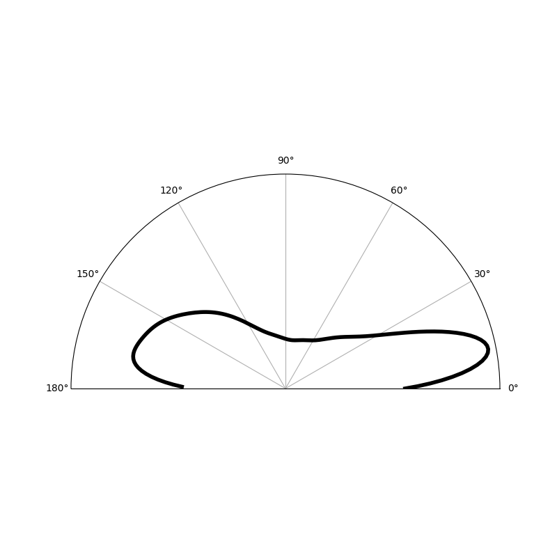
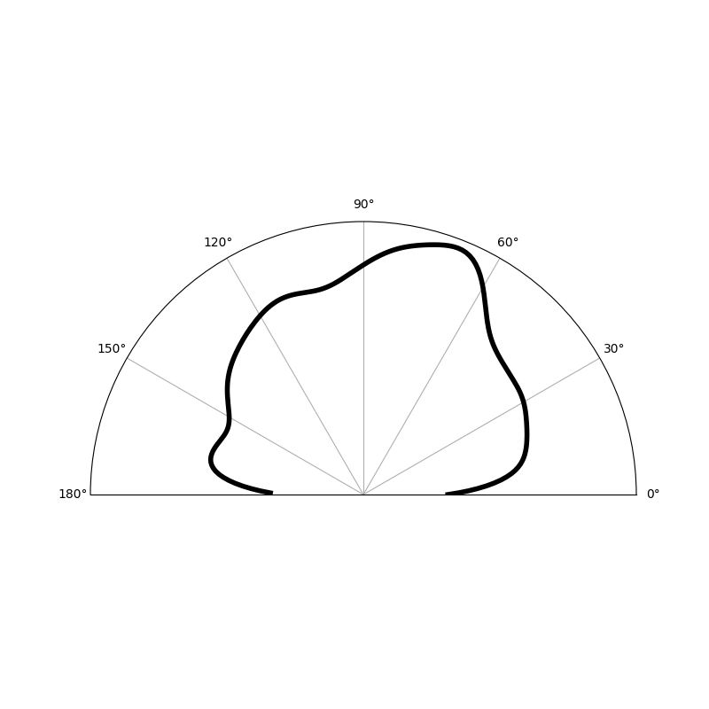

# Displacement Angle and Magnitude Measurements for Beating Cardiomyocytes

Calculate displacement angles and magnitudes for beating cardiomyocytes

If you find this code useful, please cite:

> Kauss, M. A. et al. Cardiac Cell-Derived Matrices Impart Age-Specific
> Functional Properties to Human Cardiomyocytes.
> http://biorxiv.org/lookup/doi/10.1101/2020.07.31.231480 (2020)
> doi:10.1101/2020.07.31.231480.

## Installing

This script requires Python 3.7 or greater and several additional python packages.
This code has been tested on OS X 10.15 and Ubuntu 18.04, but may work with minor
modification on other systems.

It is recommended to install and test the code in a virtual environment for
maximum reproducibility:

```{bash}
# Create the virtual environment
python3 -m venv ~/cm_env
source ~/cm_env/bin/activate
```

All commands below assume that `python3` and `pip3` refer to the binaries installed in
the virtual environment. Commands are executed from the base of the git repository
unless otherwise specified.

```{bash}
pip3 install --upgrade pip

# Install the required packages
pip3 install -r requirements.txt

# Build and install all files in the cm disp angle package
python3 setup.py install
```

The `cm_disp_angle` package can also be installed as a python package:

```{bash}
python3 setup.py bdist_wheel
pip3 install dist/cm_disp_angle-*.whl
```

After installation, the following scripts will be available:

* `calc_optical_flow.py`: Analyze phase movies and calculate direction and magnitude of displacements

The scripts can also be used in an `inplace` install, when run locally from the
`scripts` directory.

```{bash}
python3 setup.py build_ext --inplace
cd scripts
```

Where each script is run from the current directory (e.g. `./calc_optical_flow.py`, etc)

## Analyzing phase movies

This repository comes with example movies of cardiomyocytes growing on matrigel,
fetal fibroblast-derived matrix, and adult fibroblast-derived matrix. To analyse
these example movies, run:

```{bash}
calc_optical_flow.py ./data -o ./output
```

This will produce angle plots showing the principle direction of movement in the
images. Several polar plots will be produced, showing different clusters in the
movie and their principle direction(s) of motion. The `main_cluster.png` plot shows
the primary direction of motion in the movie over all moving pixels.

The adult fibroblast-derived matrix movie should look like:



The fetal fibroblast-derived matrix movie should look like:



And the matrigel movie should look like:



## Testing

The modules defined in `cm_disp_angle` have a test suite that can be run
using the `pytest` package.

```{bash}
python3 -m pytest tests
```

## Documentation

Documentation for the scripts and individual modules can be built using the
`sphinx` package.

```{bash}
cd docs
make html
```

Documentation will then be available under `docs/_build/html/index.html`
